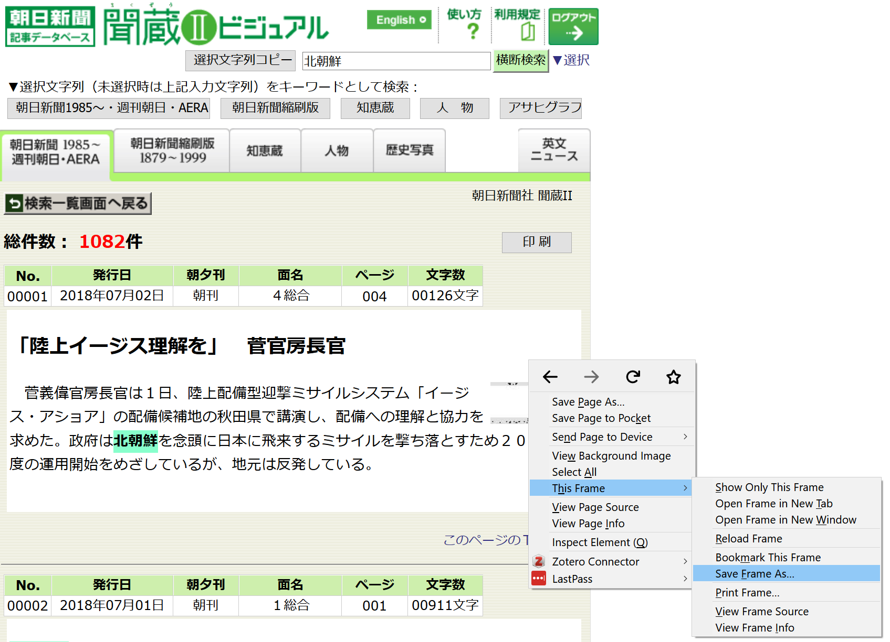

# newspapers

Import files downloaded from various newspaper databases

## Supported databases and formats

| Database                 | File type        | Function            |
|--------------------------|------------------|---------------------|
| Asahi Shimbun Kikuzo     | .html            | `import_kikuzo()`   |
| Yomiuri Shimbun Yomidasu | .html            | `import_yomidasu()` |
| Dow Jones Faciva         | .html            | `import_factiva()`  |
| Nexis UK                 | .html            | `import_nexis()`    |
| Lexis Advance            | .docx            | `import_lexis()`    |
| Integrum                 | .doc .xlsx .html | `import_integrum()` |

## Install the package

``` r
install.packages("devtools")
devtools::install_github("koheiw/newspapers")
```

## Load files

``` r
require(newspapers, quietly = TRUE)
dat <- import_nexis("tests/data/nexis/guardian_1986-01-01_0001.html")
## Reading tests/data/nexis/guardian_1986-01-01_0001.html
```

| pub                   | edition | date             | byline               | length | section | head                                                                                                      |
|:----------------------|:--------|:-----------------|:---------------------|:-------|:--------|:----------------------------------------------------------------------------------------------------------|
| The Guardian (London) |         | January 31, 1986 | By JEREMY LEGGET     | 1269   |         | Eavesdroppers who heard the guilty secrets / Covert nuclear tests by the US and Britain detected          |
| The Guardian (London) |         | January 31, 1986 | By VICTORIA BRITTAIN | 663    |         | Third World Column: Uganda tries again / National Resistance Movement takes power                         |
| The Guardian (London) |         | January 31, 1986 | By RICHARD LAPPER    | 1007   |         | Third World Review: A bad bisnes in Managua / Nicaragua’s black economy                                   |
| The Guardian (London) |         | January 31, 1986 |                      | 60     |         | Financial News in Brief / British Government support for ICI Alcan tax case in California                 |
| The Guardian (London) |         | January 31, 1986 | By MICHAEL SIMMONS   | 401    |         | Minister predicts downturn in Singaporean economy                                                         |
| The Guardian (London) |         | January 31, 1986 | From MARK TRAN       | 350    |         | Aid appeal get cool reception / US Administration’s proposals to increase the foreign aid budget flounder |

## Parse date

The functions return datelines as character, so users should parse them
using `stri_datetime_parse()` with appropriate locale and time-zone
settings.

``` r
require(stringi)
dat_en <- import_nexis("tests/data/nexis/guardian_1986-01-01_0001.html")
## Reading tests/data/nexis/guardian_1986-01-01_0001.html
dat_en$date2 <- as.Date(stri_datetime_parse(dat_en$date, "MM, dd, uuuu", tz = "GMT"))
head(dat_en[c("date", "date2")])
##               date      date2
## 1 January 31, 1986 1986-01-31
## 2 January 31, 1986 1986-01-31
## 3 January 31, 1986 1986-01-31
## 4 January 31, 1986 1986-01-31
## 5 January 31, 1986 1986-01-31
## 6 January 31, 1986 1986-01-31

dat_de <- import_nexis('tests/data/nexis/spiegel_2012-02-01_0001.html')
## Reading tests/data/nexis/spiegel_2012-02-01_0001.html
dat_de$date2 <- as.Date(stri_datetime_parse(dat_de$date, "dd. MM uuuu", tz = "CET", 
                                            locale = "de_DE"))
head(dat_de[c("date", "date2")])
##                                         date      date2
## 1      27. Februar 2012 Montag 9:50 PM GMT+1 2012-02-27
## 2                           27. Februar 2012 2012-02-27
## 3     25. Februar 2012 Samstag 2:01 PM GMT+1 2012-02-25
## 4     24. Februar 2012 Freitag 9:47 AM GMT+1 2012-02-24
## 5  23. Februar 2012 Donnerstag 6:34 PM GMT+1 2012-02-23
## 6 23. Februar 2012 Donnerstag 11:49 AM GMT+1 2012-02-23
```

## Download files

### Asahi Shimbun Kikuzo

In the Kikuzo database, you can display up to 100 full-texts news
articles in your browser. However, you cannot download the articles as
an HTML file in a format this package can read, becasue news articles
are in frames. To save the articles, you should use Firefox’s context
menu “Save Frame As” (or other browsers’ equivalent) to save pages in a
frame.



### Dow Jones Faciva

The Factiva database offers a button to display full-texts in a pop-up
window: check all boxes, click “Format for Saving” (Floppy Disk icon)
and select “Article Format”. You only need to save the HTML file in the
pop-up window by “Save Page” (or press Ctrl + S).


